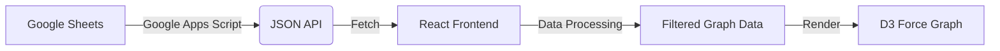

# 🕸️ Knowledge Graph Visualization System

這是一個基於 **React** 與 **D3.js** 的動態知識圖譜視覺化專案。
其核心特色在於使用 **Google Sheets** 作為「資料庫 (CMS)」，透過 Google Apps Script (GAS) 提供 API，並具備自動化的資料驗證與除錯機制。

---

## ✨ 主要功能 (Features)

### 1. 前端視覺化 (Frontend)

* **Force-Directed Graph**: 使用 D3 力導向圖呈現節點與關聯。
* **動態時間軸 (Time Filtering)**:
* 透過滑桿過濾特定年份的事件與人物。
* **無限期邏輯**: 若節點未設定年份，則視為永久存在，不會被過濾掉。


* **搜尋與聚焦 (Search & Zoom)**: 支援搜尋節點或關連，選中後自動飛行聚焦並開啟資訊卡。
* **互動圖例 (Interactive Legend)**: 點擊圖例可高亮特定群組 (Group)。
* **資訊卡 (InfoCard)**: 點擊節點顯示詳細資訊（支援多來源 Info 合併）。
* **UI 自動隱藏**: 滑鼠靜止或離開操作區時，自動隱藏工具列以提供沉浸式體驗。

### 2. 後端與資料管理 (Backend / Google Sheets)

* **多工作表整合**: 自動讀取所有 `nodes_*` 與 `link_*` 開頭的工作表並合併資料。
* **自動化資料驗證 (Data Validation)**:
* 🔴 **衝突偵測**: 若同一個 Node ID 在不同工作表中被定義為不同 Group，自動將儲存格標記為 **紅色**。
* 🟡 **缺漏偵測**: 若 Link 中使用了未定義的 Node ID，自動在 Link 工作表將該 ID 標記為 **黃色**。


* **API 輸出**: 將整理後的資料輸出為標準 JSON 格式。

### 3. 開發者工具 (Dev Tools)

* **FilteredGraphLogger**: 一個無介面 (Headless) 組件，用於在 Console 追蹤過濾後的資料流與特定 ID 的存續狀態。

---

## 🛠️ 系統架構 (Architecture)



---

## 📊 資料庫設定 (Google Sheets Setup)

### 1. 工作表命名規則

系統會根據工作表名稱的前綴詞來決定用途：

| 工作表名稱 | 用途 | 欄位結構 |
| --- | --- | --- |
| `nodes_Main` | 主要節點資料 | `ID`, `Group`, `Info`, `Start Year`, `End Year`, `Lon`, `Lat` |
| `link_Relations` | 連線資料 | `Source`, `Target`, `Group`, `Label`, `Info` |
| `nodes_color` | 節點顏色設定 | `Group`, `Color` (#Hex) |
| `links_color` | 連線顏色設定 | `Group`, `Color` (#Hex) |

### 2. Google Apps Script (GAS)

請在 Google Sheet 中開啟 `Extensions` > `Apps Script`，貼上專案中的 `Code.gs`。

#### 核心邏輯 (`doGet`)

腳本執行時會進行以下步驟：

1. **清除舊標記**: 清除 `nodes_` 表的 B 欄背景色、`link_` 表的 A/B 欄背景色。
2. **掃描 Link**: 建立連線，暫存所有出現的 ID 位置。
3. **掃描 Node**:
* 合併同 ID 的 Info。
* 檢查 Group 一致性，若衝突則記錄。


4. **執行批次上色**:
* 🔴 **衝突**: 將 Group 定義不一致的 `nodes_` 儲存格塗紅。
* 🟡 **缺漏**: 將 `link_` 中未在 `nodes_` 定義的 ID 塗黃。


5. **輸出 JSON**: 回傳最終資料。

#### 部署方式

1. 點擊 "Deploy" > "New deployment"。
2. Type: **Web app**。
3. Who has access: **Anyone** (以便前端讀取)。
4. 複製生成的 **Web App URL**。

---

## 💻 前端開發指南 (Frontend Guide)

### 安裝與執行

```bash
# 1. 安裝依賴
npm install

# 2. 啟動開發伺服器
npm start

```

### 關鍵組件說明

#### `KnowledgePage.jsx`

主頁面，負責資料獲取、狀態管理與組件組裝。

* **資料過濾邏輯 (`useMemo`)**:
```javascript
const validNodes = graphData.nodes.filter(node => {
  // 若無年份，視為永久顯示
  if (!node.start_year) return true;
  // 若年份格式錯誤，視為永久顯示
  if (isNaN(parseInt(node.start_year))) return true;
  // 時間軸交集檢查
  return (nodeStart <= sliderMax) && (nodeEnd >= sliderMin);
});

```


#### `ForceGraph.js`

封裝 D3.js 邏輯的 Class。處理 Canvas 繪圖、Zoom、Drag 以及高亮邏輯。

#### `FilteredGraphLogger.jsx`

除錯工具。

* **用法**: 引入並放置在 JSX 中。
```jsx
<FilteredGraphLogger data={filteredData} targetId="Elon Musk" />

```


* **功能**: 在 Browser Console 顯示目前時間軸下，該 ID 是否存在，以及剩餘的連線數量。

---

## 🎨 資料驗證顏色對照表

當您重新整理網頁（觸發 Apps Script）後，Google Sheet 會出現以下視覺提示：

| 顏色 | 意義 | 解決方法 |
| --- | --- | --- |
| 🟥 **淺紅 (Light Red)** | **Group 定義衝突** <br>

<br> (同一 ID 在不同 `nodes_` 表有不同 Group) | 檢查所有紅色標記的節點，統一其 Group 欄位。 |
| 🟨 **淺黃 (Light Yellow)** | **節點缺漏** <br>

<br> (在 Link 中用到，但未在任何 `nodes_` 表定義) | 複製黃色儲存格的 ID，新增至 `nodes_` 表並填寫詳細資料。 |
| ⬜ **無色** | **資料正常** | 無需動作。 |

---

## 📝 待辦事項 / 未來優化 (TODO)

* [ ] 實作地理位置 (Map Mode) 切換功能。
* [ ] 優化手機版操作體驗。
* [ ] 增加更多圖表統計分析 (Dashboard)。

---

## 📄 License

MIT License